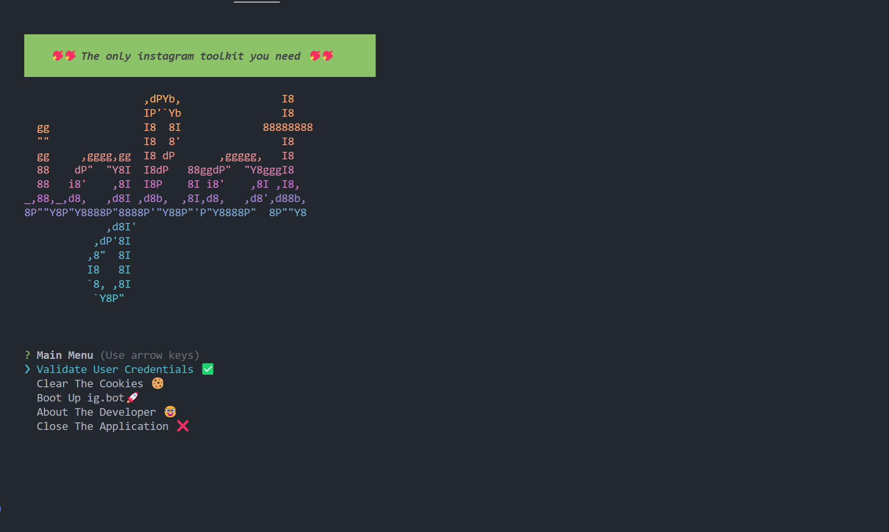

# ig.bot

_A node.js based Instagram💖 bot🤖 made to make life of a content creator🗒️ easy🍀_

[](https://youtu.be/EOfs2hQKsSQ)

## Features

> I'm planning to add more features in the future. But I'm not sure how much time I'll have to spend on it.

-   Follow users✅
-   Unfollow users✅
-   Get your account's followers✅
-   Get your account's following✅
-   Get users who don't follow you back✅
-   Unfollow users who don't follow you back✅
-   Like posts based on hashtags❌
-   Follow users based on the hashtags on their post❌

## Installation

Install my-project with npm

Make sure you have the following softwares installed:

-   [git](https://git-scm.com/downloads)
-   [nodejs v16.15.0](https://nodejs.org/dist/v16.15.0/)

```bash
  git clone https://github.com/Muhammed-Rajab/ig.bot.git
  cd ig.bot/
  npm install
  touch config.env
```

Inside `config.env` file, you should add the following text, replacing the placeholders with your data

```bash
INSTAGRAM_USERNAME="your-instagram-username"
INSTAGRAM_PASSWORD="your-instagram-password"
```

You need to compile the Typescript code to Javascript before running it

```bash
npm run build
```

## Documentation

To start the application, run

```bash
npm start
```

If everything went right in the installation, you will get
the following output in your terminal



> The color may vary depending on your terminal theme. I'm using the built-in theme of VS Code.

You can navigate through the menu by using the arrow keys.

_Voila!_ You made it till here! Everything else in the application is self-explanatory.
There's no limit to how many times you can use the application and it's completely free.

## Contributing

Do you have any suggestions or want to contribute? Feel free to open an issue or send a pull request. I'll be happy to hear from you.

## Report a bug

Are you sure you found a bug? Please open an issue or send a pull request. I'll be happy to hear from you.
